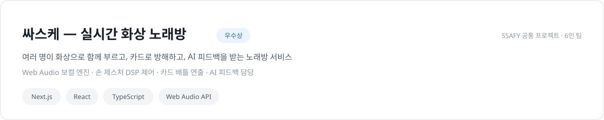
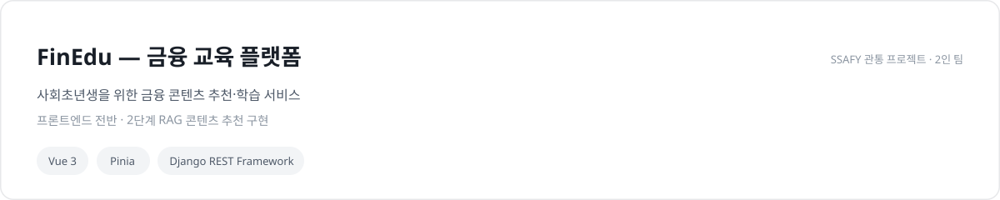

<picture>
  <source media="(prefers-color-scheme: dark)" srcset="assets/header-dark.svg">
  
</picture>

[blog](https://blog.naver.com/jangms1126) · [email](mailto:jangms11263124@gmail.com) · [til](https://github.com/jangms11263124/TIL)

<a href="https://github.com/jangms11263124/ssasukae">
<picture>
  <source media="(prefers-color-scheme: dark)" srcset="assets/card-ssasukae-dark.svg">
  
</picture>
</a>

<picture>
  <source media="(prefers-color-scheme: dark)" srcset="assets/card-finedu-dark.svg">
  
</picture>

SSAFY 공식 기자단 '싸피셜' · 반장/CA · 입과 자기소개 발표 1위

배운 것은 매일 [TIL](https://github.com/jangms11263124/TIL)에 기록합니다.

